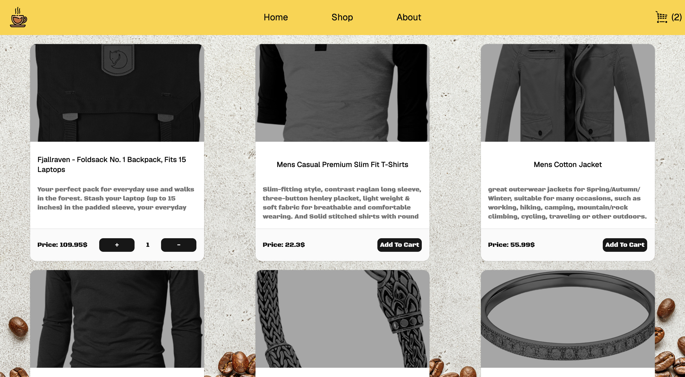
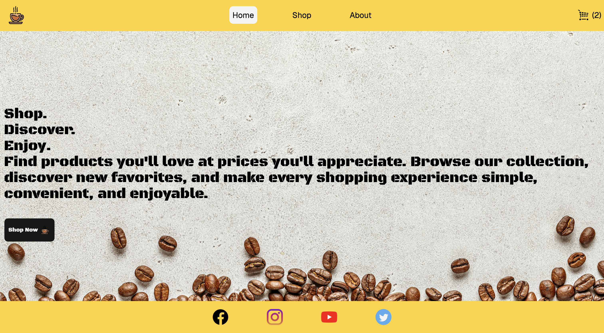
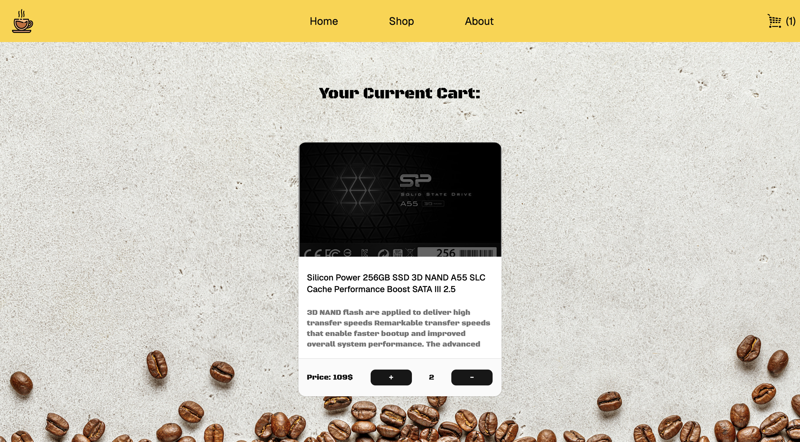

Shopping Cart

A responsive shopping cart application built with React, TypeScript, Tailwind CSS, shadcn/ui, and React Router. The application fetches products from the Fake Store API and allows users to browse products, add them to a cart, and manage product quantities.

Features
Home page with a custom background and shopping introduction
Shop page displaying products fetched from an API
Product cards with:
Product image
Title
Description
Price
Add to Cart button
Cart functionality
Add products to cart
Increase product quantity
Decrease product quantity
Automatically remove a product when its quantity reaches zero
About page
Navigation between Home, Shop, About, and Cart
Responsive UI using Tailwind CSS
Styled UI components using shadcn/ui
TypeScript interfaces for products and cart items
React Router for page navigation
No React Context used; cart state is managed using useState and passed through props
Technologies Used
React
TypeScript
Vite
Tailwind CSS
shadcn/ui
React Router
Fake Store API
API

Products are fetched from the Fake Store API:

https://fakestoreapi.com/products

Each product contains information such as:

id
title
price
description
category
image
rating
Project Structure
src/
│
├── components/
│   ├── ui/
│   ├── Header.tsx
│   ├── Footer.tsx
│   ├── Home.tsx
│   ├── Shop.tsx
│   ├── About.tsx
│   ├── Cart.tsx
│   ├── Productcard.tsx
│   └── Cartcard.tsx
│
├── types/
│   └── product.ts
│
├── App.tsx
├── main.tsx
└── index.css
TypeScript Types

The product received from the API is represented using the Product interface:

export interface Product {
  id: number;
  title: string;
  price: number;
  description: string;
  category: string;
  image: string;
  rating: {
    rate: number;
    count: number;
  };
}

Cart items extend the product and add a quantity:

export interface Cartitems extends Product {
  quantity: number;
}
Cart Management

The cart is managed using React's useState:

const [cart, setCart] = useState<Cartitems[]>([]);

When a product is added:

If it isn't already in the cart, it is added with quantity: 1.
If it already exists, its quantity is increased.
The + and - controls allow the quantity to be changed.
Products are removed when their quantity reaches zero.

Cart state is shared between components using props, without using React Context.

The demonstration of the project can be found on https://shopping-cart-wzk6-jet.vercel.app/cart

